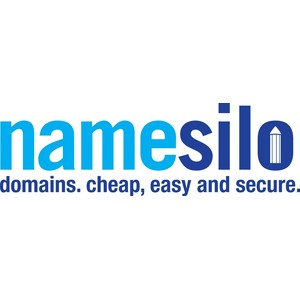

- Company: NameSilo Technologies Corp.
- Market Cap: 23.16M
- Share Price: 0.25
- 52 Week Hi/Low: $0.17 – $0.55
- Shares Issued and Outstanding: 62.32M
- Warrants: 10.5M
- Fully Diluted: 92.65M
- Options: 3.5M
- Insider Ownership: 12.1%
- Last Financing: 2020 – $5.7M / 29M units at $0.20 full warrant at $0.30

Namesilo started out as an investment holding company called Bristo Inovations where they held public securites. In 2018 they aquired Namesilo for 15M. Namesilo is a domain registrar business. They compete with Go Daddy, Name Cheap, Tocows and other Domain providers. They provide domains and have added some additional services. Their 'competive' advantage was being a low cost provider of these services and the larger players in this space don't want ruin their gross margins by competing with Namesilo.   

Since 2018 Namesilo has had a growing customer base of about 80% YOY with a churn rate of about 13%. They took the business from having 1.85M to 3.6M users and was growing revnues rapidly. This growth continued strong into 2019 but by 2020 the domain growth was completly killed when they tried to roll out some additional on services. By Q2 and Q3
domains numbers started to shrink to until they hit an uptick in Q3 and Q4 in 2020 to bounce back to 3.6M. They are still growing revenue and domains about 10-20% but not like the 100% they had the previous years. 

Normally a slow down with this kind of growth wouldn't be a problem for most capital light business but they have to find a way to service the debt accured by purchasing namesilo. So on September 28, 2020 they dilluted their shareholders 50% causing the stock to drop from 0.50 to 0.23. This left a bitter taste in shareholder mouths as they could have use the investment portfolio to pay down the debt instead of doing a cheap equity raise. Since then the stock hasn't recovered even though the actual fundamentals have gotten better with the investment portfolio growing at 400% and then eventual announcement of the sale of a 100% ROI investment didn't excite the market at all. 

On Namesilo Dec, 2, 2020 Namsilo announced they had entered into a non-binding agreement to sell the company to WGH Holdings B.V. for 40M and have 60 days to carry out any do dilligence so the proposed sell date should be around March, 2, 2021. This leaves Namesilo shareholders 30M after the expenses of 20% paid to Kristaps Ronka team. The 30M plus the investment portfolio of 12.5M leaves shareholders with around 42.5M. The current market cap of namesilo is 23.5M and trading around $0.25. This naturally leaves a short term trading opportunity, accumulate under 0.30 and sell near $0.35-0.40 in a couple of months when the deal goes through.

