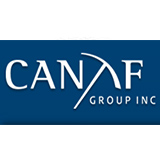

** Note: All numbers are in USD unless stated other wise

- Company: Canaf Investments Inc.
- Market Cap: 4.25 M CAD
- Share Price: 0.06 CAD
- 52 Week Hi/Low: $0.035 – $0.075 CAD
- Shares Issued and Outstanding: 47.43M
- Warrants: none
- Fully Diluted: 47.43M
- Options: none
- Insider Ownership: 25%
- Last Financing: 2008 – $2M / 8M units at $0.25 CAD full warrant at $0.35 CAD

Canaf investment group is a company with has a long-term strategic focus on growing sustainable shareholder wealth by investing long-term growth sectors within South Africa. Their main business is to make coking coal for steel production and have recently expanded into residential real estate. more info: http://www.canafgroup.com/corporate/about-us/ 

Since David way and the team took over in 2007 they have been lowering their debt and have been improving operational efficiency of the coking business (southern coal). They took shareholder equity from (201,812) in 2008 to $4,001,213 as of july 2020 ($0.11 CAD). Growing it's book value by 36% per year. 

Unfortunately, David Way step down from the board of directors on December 4, 2020 due to health reasons leaving his son Christoper Way as CEO. Christoper Way has been opperating the coking business since 2011 and now has been given the keys so to speak. 

Over a 10 year baring out 2008 and 2016 Southern Coal has produced a normalize FCF of about 400k (500k CAD) giving this a yeild of about 8.5% from current price. In recent, years the FCF rate has expanded due to coal price going up 50%, operational efficiencys and adding an additional another customer bringing FCF around $1 million (1.2 million CAD) or a yeild of 20%. The industry average is currently around 14.3% with leverage. Most coal producers have a worse FCF yeild and are highly levered. Even if we take the low end of valuations this company is still undervalued on almost every metric relitive to it's peers. 

Now, the icing on the cake is they are expanding into residental  real estate providing incrimental growth. Canaf bought their first property in 2019 and expect to earn a net yeild of 10% per year. I know it's still a small portion of their business but i'm expecting them to ramp it up. It's also going to be a lot more recession proof then coal.

I think the stock is worth around 10 million CAD for a FCF rate of 10%. This does not include a growth rate of the real estate side of the business as I want atleast 2 years of earnings before I assess it.

risks:

- foreign currency exchange (ZAR has lost 50% of value compared to USD over the past 10 years)
- extreme customer concentration only 3 customers
- - Arcelor Mittal & BHP Billiton (85% of revenue)
- - unknown (15% of revenue)
- political unrest 
- commodity
- illiquid 
- covid
- very capital intentsive

pros: 

- very cheap (huge margin of safety)
- no debt
- hidden growth

long CAF.v