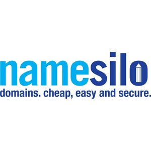

- Company: NameSilo Technologies Corp.
- Market Cap: 23.16M
- Share Price: 0.25
- 52 Week Hi/Low: $0.17 – $0.55
- Shares Issued and Outstanding: 62.32M
- Warrants: 10.5M
- Fully Diluted: 92.65M
- Options: 3.5M
- Insider Ownership: 12.1%
- Last Financing: 2020 – $5.7M / 29M units at $0.20 full warrant at $0.30

The Namesilo deal was supposed to go through during Febuary of this year. According to the inital press release. https://ceo.ca/@thenewswire/namesilo-technologies-corp-enters-into-letter-of-intent. Well... the deal never happend and a couple of month later management say they are still in talks of selling namesilo for $0.30 to WGH Holdings BV. https://ceo.ca/@thenewswire/namesilo-technologies-corp-provides-corporate-update. I still think it's a buy here given the adequate margin of saftey provided by the investment portfiolio. This plus the domain side of things are beginning to pick up again so the growth rate might not be as bad as I initally under wrote. Still long. 

