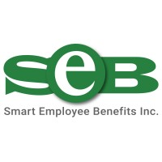
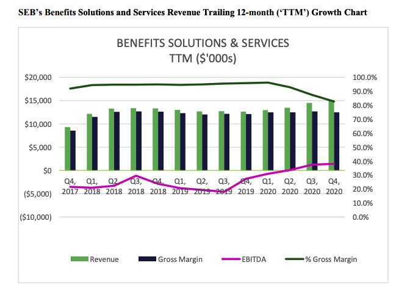

- Company: Smart Employee Benifits
- Market Cap:  $34.07M
- Share Price: $0.20
- 52 Week Hi/Low: $0.08 – $0.29 
- Shares Issued and Outstanding: 166,793,066 
- Warrants: 1,000,000
- Fully Diluted: 172,836,686
- Options: 10,117,500
- Insider Ownership: 39.9%
- Last Financing: Nov. 16, 2020 ($20,000,000 convertible debture)

Smart Employee Benifits (SEB) is an end-to-end technology service provider. SEB operates in both government and corporate. Their revenue is derive from government, insurance, e-commerce and healthcare and group benefits. They have 2 devisions technology and benifits operations. 

### Tech Operations

The tech operations works on software, solutions and services. It has carved out a little niche but is a low marginal operation so their is not much of in a way oppertunity on it's own but provides SEB the opportunity to sell it's higher margin (benifits operation) by exploting the existing relationship given the security clearance.

The tech operation makes just under $3M in EBITA and has a contract backlog of around $300M. Contracts range from 2 to 6 years from roughly 150 clients of both corporate and government with a 70% win rate. Since covid-19 their revenue droped a little but this is fine as it's just a delay in contract processing which will all be back in 2021. I think once all the contracts are processed the tech operation will produce around $4-5M in EBITA. The tech operation is worth roughly $40-50M give or take or a 10x EBITA multiple. For a highly reacuring revenue stream. This does not include growth or incrimental improvements from their streamlining of operations which we'll get to later.

### Benifit Operation

The benifit operation is a backend processing platform. SEB has combined all their prevouis aqusitions into one giant platform that can be use seperatly or incunjunction to allow for different revenue models depending on their customers needs. This allows them to be able to provide for 90%+ of all benifit processing which is unique to SEB while the competition uses old and fragmented technology. 

Management believes that they can use the existing module software to bring "revenue per plan member per month" (“RPPMPM”) from $3 to $9 a month to $20 to $42. SEB currently has around 330,000 plan members with another 180,000 in transition or roughly $1.3B in premium. 80% of all additional new gross margins after maintenance CAPEX that will be converted into EBITA going straight to the bottom line. If they only extract their current customer based of the RPPMPM at the low end they can see revenues double which 90% of it is recurring with a backlog of $100M. If they are able to get it on the high end of that spectrum and add more customers then EBITA could grow masively. 
Currently, the revenues are $15M, gross margins are at $12M which covers the fixed operating costs. You can see it just hitting that inflection point as shown here. 

It went from an EBITA loss of $1.8M in 2019 to a $1.4M EBITA in 2020. Margins have gone down as they want to have a joint partnership where they can profit share with channel partners. Anyways, management is planning over the next few years to get $3B of premium under management which would lead to about 45M in revenue, 20M in EBITA asuming there is no improvement in the RPPMPM. Another way we could look at this equation is by using the industry average process spend of 7% - 15% as a proxy for revenue. if we take $3B * 7% we get $210M in revenue, $168M gross, $134.4M in EBITA. However, this is a very bullish assumption. 

As it currently stands I would value the benifits devision at a 20X EBITA multiple or $30M. If they are able to reach their goals of more plan members and expanding the RPPMPM it would deserve a much higher mutliple. 

### Shared Costs

Now heres the icing on the cake. Both operations have natural cost synergies shared between each them which will drive the fixed costs  down even further. 

- Both operations and the corporate office can pull from the same pool of talent (theres a lot of human capital in this company so completing projects should be faster than the average microcap)

- The benfits operation requires IT infrastructure that the Tech operations already provides

- SEB can use it's benfit platform internally for the corporate office and Tech operation

- Corporate office already provides support for customers which both operations can use

### Valuation

If we take the valuation of both the tech and benifits operation and put them together on an EBITA multiple we get a current "fair value" of around 80M - 100M.(I still think thats too low but I'm being very conservative) If we look at the public market it currently values SASS companies at 8-10x sales so if we take last years sales of 50M * 8 = 400M and for benifit companies People Corporation recently just recently sold for about 4-5x current revenues at 15M * 5 = 75M. So we get a value of around 475M. 475M / 34M = 10-14X current price in a short amount of time. 

### Risks

So why is this company so cheap you ask. Well... There are a few reasons.

- SEB has a lot of debt about $32M from prevouis acquisitions and the market has tech companies with a lot of debt (They just did a convertible debuture at $0.25 for $20M so this shouldn't be an issue which if they converted it would leave shares around 250M)

- SEB has a lot of shares outstanding from dilluting their previuous shareholders for aqusitions. (This turns shareholders off but this to is about to change as the benifits devision will provide the cash flow) 

- SEB is currently unprofitiable as their corporate office currently eats into the 2 profitable operations (this is whats creating the opertunity)

- Management in the past has over promised under delivered (I believe this is about to change given we are at an inflection point in the benifits devision)

- Both their operations are is a really competive space (SEB has a better tech according to customers and the win rate speaks for itself)

- It is listed on the TSX venture (enough said there)

- It's a gross nanocap (lack of analysis coverage)

### Conclusion 

SEB has an asymmetric risk to reward and is worth taking a look at. It is a very sustanable recurring business with over $400M in backlog and is now about to hit profitablity with huge earnings potential being hidden behing the tech operations and once it becomes "discovered" it will rerate appropiately. Long SEB 